<h1 align="center"><a href="https://cesargarciajr.github.io/QuizTmas/" target="_blank">THE ULTIMATE RPS</a></h1> 

The Ultimate RPS is a fun and diferent approach for one of the most famous games of the world. Now as a backend application in a mock terminal you can have fun and chellange the computer for a 5 round game. If you in 3 times out of 5 a surprise is gonna be unlocked. Also pay attention to the hints and make a smart choice to become the RPS Legeng. Have fun!

[**Link to The Ultimate RPS**](https://the-ultimate-rps-75d98298966f.herokuapp.com/)

# Contents

- [The Ultimate RPS](#the-ultimate-rps)
- [Contents](#contents)
  - [User Experience (UX)](#user-experience-ux)
    - [User Stories](#user-stories)
    - [FlowChart](#flowchart)
    - [Site Structure](#site-structure)
    - [Desing Choices](#design-choices)
  - [Features](#features)
    - [Landing Play Page](#landing-play-page)
    - [Welcome Message](#welcome-message)
    - [Main Menu](#main-menu)
    - [Rules](#rules-menu-option)
    - [Credits](#credits-menu-option)
    - [Start Game](#start-game-menu-option)
    - [Game Over Message](#game-over-message)
    - [Selected Valid Option](#selected-valid-option)
    - [Comparing Computer vs User choices](#comparing-computer-vs-user-choices)
    - [Tied Round](#tied-round)
    - [Game Over](#game-over)
    - [Hidden Features](#hidden-features)
    - [Future Features](#future-features)
  - [Testing](#testing)
    - [Testing Process](#testing-process)
    - [Bugs and Issues](#bugs-and-issues)
  - [Technologies Used](#technologies-used)
  - [Deployment](#deployment)
  - [Credits](#credits)
    - [Content](#content)
    - [Media](#media)
  - [Acknowledgments](#acknowledgments)
- [THANK YOU!](#thank-you)

___

## User Experience (UX)

  ### User Stories

  - #### First-Time Visitor Goals
     i.   As a First time user I want to be able to intuitively learn how to play the game without even reading the Rules.
     ii.  But if needed check the Rules and see if its clear.
     iii. I might have to contact the developer for any bug or leave a message.
     iv.  Have fun!

  - #### Returning Visitor Goals
     i.   As returning user I want the be able to play the game.
     ii.  Check if there is any updates to the game.
     iii. Have fun!

  - #### Frequent User Goals
    i.   As frequent user I want the be able to play the game.
    ii.  Check if there is anyupdates to the game.
    iii. Have fun!

  [Back to top](<#contents>)
  
  - ### FlowChart
    The flowchart was a very useful tool to plan ahead and understand how to build the application below you can see the chart that was made using the [**Lucid**](https://lucid.co/)

    

[Back to top](<#contents>)

  - ### Design Choices
      The idea was to build a terminal based application with smooth transitions to make the UX even more seamless and intuitive. I added few diagrams to make the game more user friendly and make look better as you can see the [Features](#features) section.

[Back to top](<#contents>)

## Features

  ### Landing Play Page
As part of the game a landing area presents the Rock, Paper, Scissors and Gun as hints of how to "unlock" the Legend by selecting the gun to win over all options:

   

[Back to top](<#contents>)

  ### Welcome Message
Welcome message gives the user a clear idea of the game and a 4.5 second to see this message while game is loading is a user friendly interaction.

  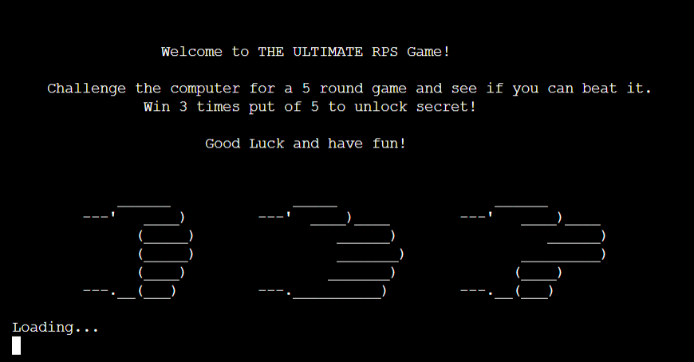 
  
[Back to top](<#contents>)
        
  ### Main Menu
The main menu gives the user clear options to select and navigate through it.

  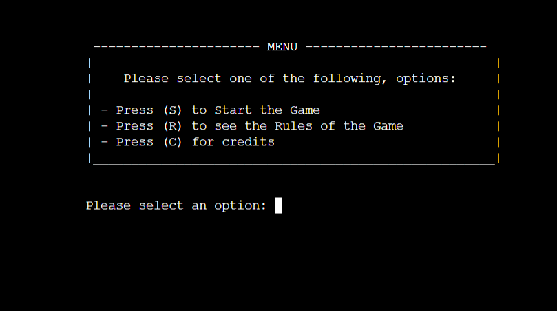 

[Back to top](<#contents>)

  ### Rules Menu Option
Rules are clear and easy to understand making user experience more effective regarding to know how to play the game and use the system.

  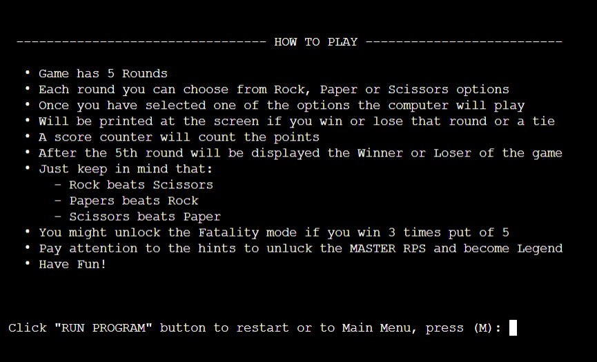 
 
[Back to top](<#contents>)

  ### Credits Menu Option
Credits option gives the user to contact the developer in case o bugs or issues found, or to get in touch for futures projects

  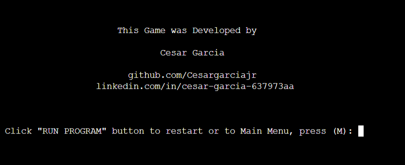 
 
[Back to top](<#contents>)

  ### Start Game Menu Option
Once the user start the game it prints to the console a Rock, Paper, Scissors diagram to show user the options also prints the Round counter and a score section to keep track the progress of the game. Finally asks the user to input the option as the user can type "r" "R" "rock" respectivly to the options available. If not a "Invalid option will be printed"

  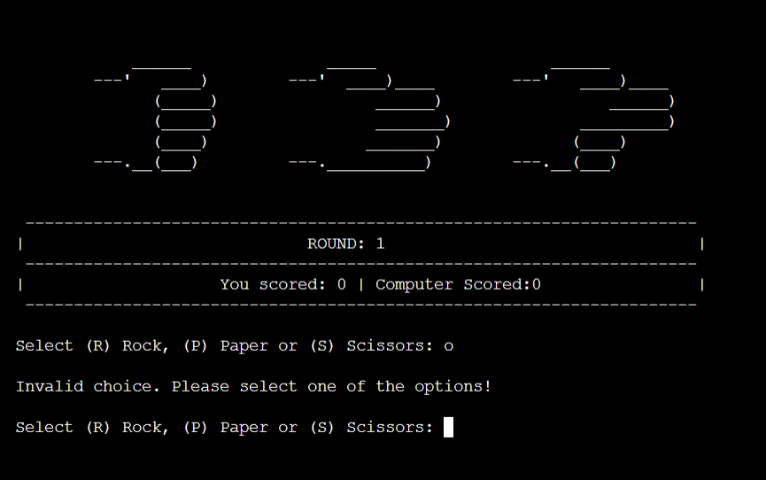 
 
[Back to top](<#contents>)

  ### Selected Valid Option
Once a valid option is selected it will show what was selected and generated randomly by the computer

  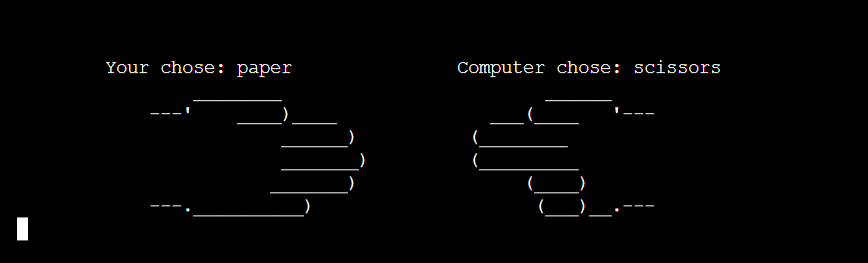 
 
[Back to top](<#contents>)

  ### Comparing Computer vs User choices
The system will compare the computer and the user choice and print an outcome for that round. Also increasing the round and the score if win or lose round

  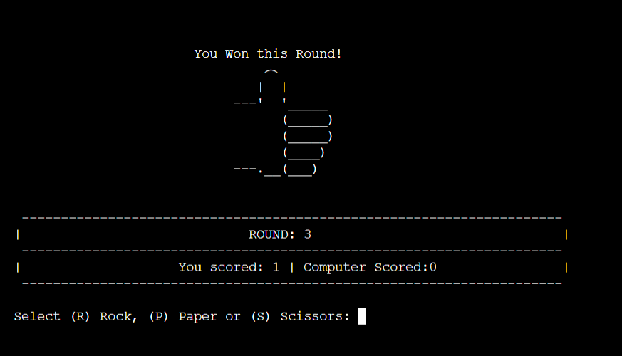
  
  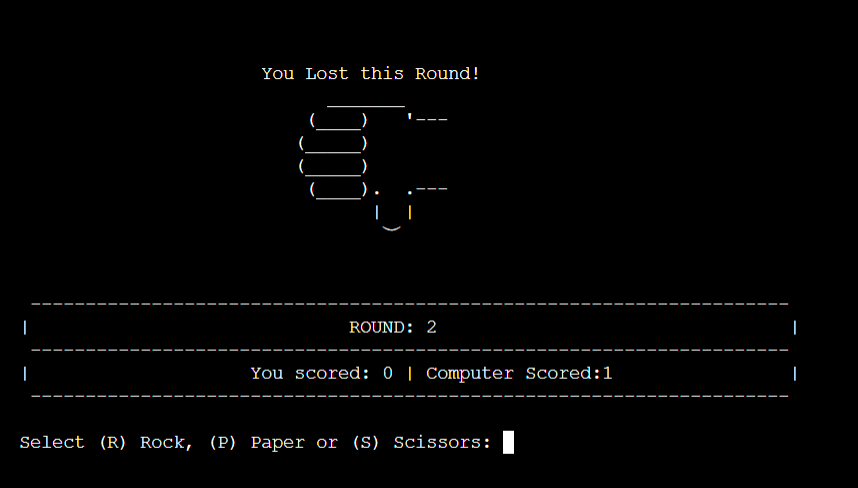
 
[Back to top](<#contents>)

  ### Tied Round
In case the round is Tied a message will be showed and no score will be increased

  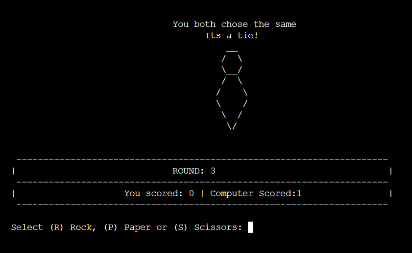

[Back to top](<#contents>)

  ### Game Over
After 5 rounds system will compare the scores and print a final message:

If user wins:

  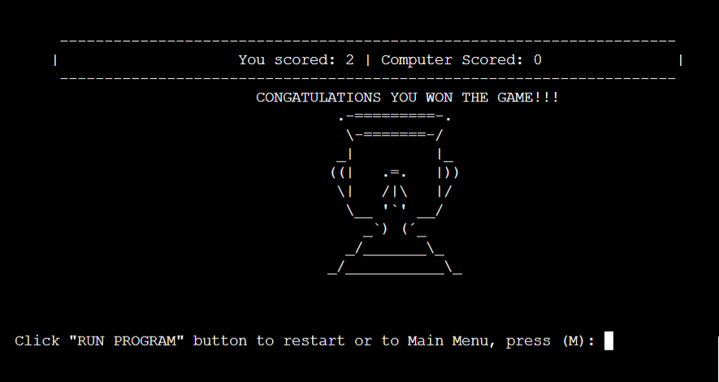

If user lose:

  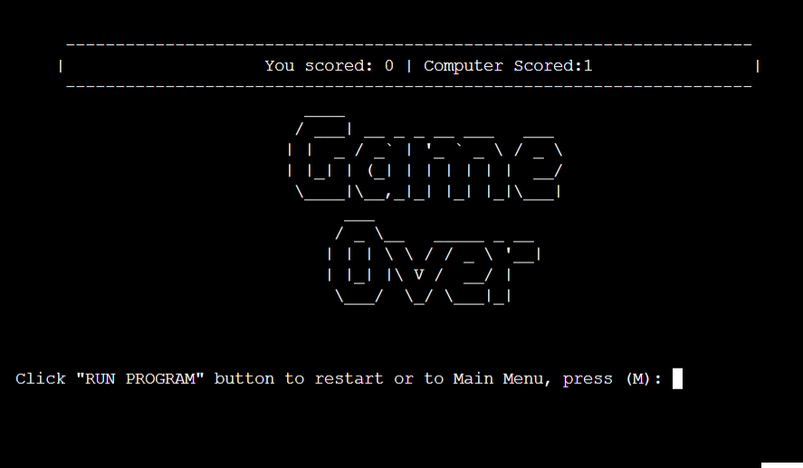

If its a tie:

  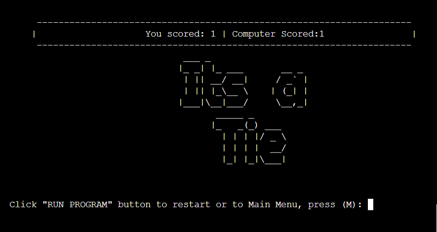

 
[Back to top](<#contents>)

  ### Hidden Features
The user can see the hints and "unlock" the hidden features. If user selects the "Gun" he will automatically will the game and a "Legend" message will be printed:

  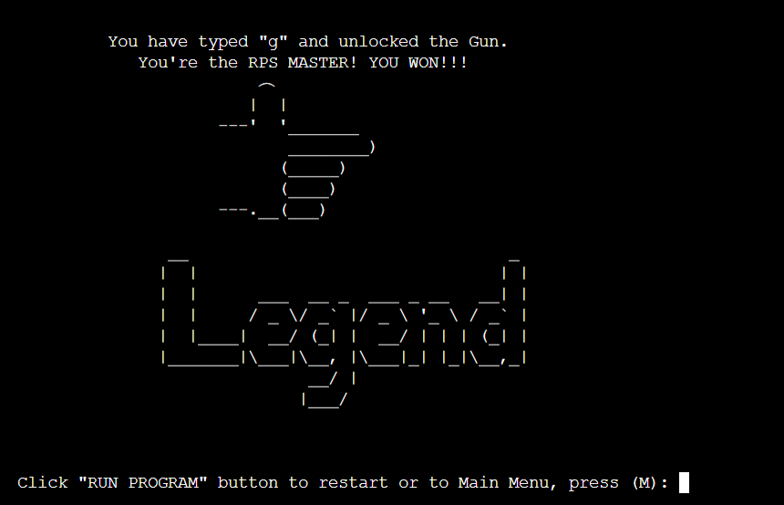

If the user wins 3 out of 5 rounds the user will be asked to "finish" the computer the "Fatality" will be printed:

  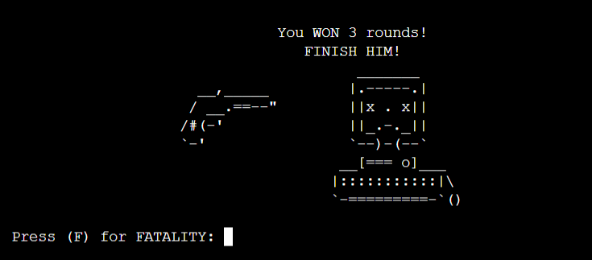

  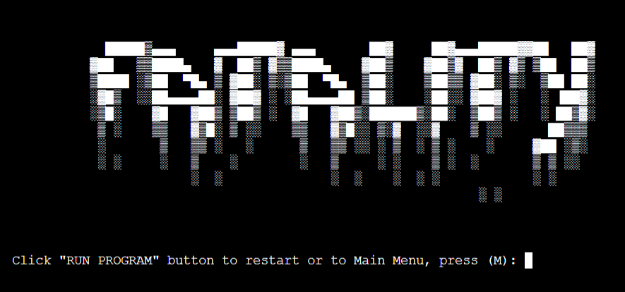

[Back to top](<#contents>)

  ### Future Features
For feature features I think would be nice to make a colourful game for better user experience also implement if the user wins 3 times in a row he could activate the "nuclear bomb" and win the game. Those hidden features could make a difference and keep the users interested to play more and discover and unlock them.

[Back to top](<#contents>)

## Testing

The game was tested and validate with PEP8CI with no errors. However the diagrams apresented a few flags and the solution is in the [Bugs and Issues](#bugs-and-issues) section of this file.

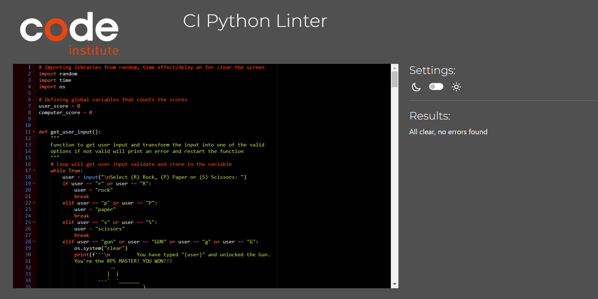

[Back to top](<#contents>)

 ### Bugs and Issues
Debugging and troubleshooting were done constantly throughout development.

the PEP8CI presented a few flags regarding to the diagrams and the solutions I found for those was to add "r" before some to the diagrams layout and a "# noqa" and the end of the diagrams, as you can see highlighted in the yellow box of the image below:

 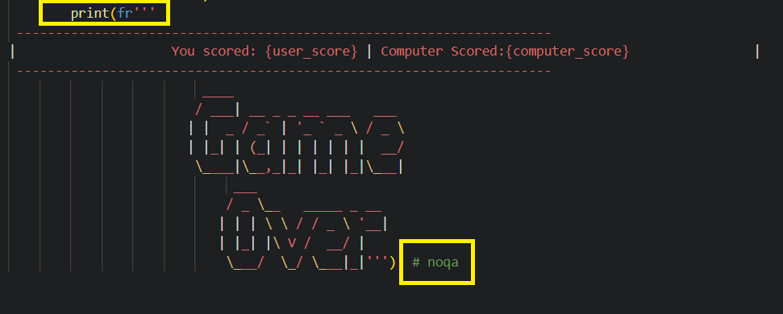

 The links a found the solution are credited in the [Credits](#credits) section of this file.

[Back to top](<#contents>)

___

## Technologies Used
I used the following technologies, platforms and support in building my project:
- The application was built in Python.
- The [**Code Institute**](https://codeinstitute.net/) modules/lessons aided my learning and many of the concepts learned were applied in this project.
- [**GitHub**](https://github.com/Cesargarciajr/bloom-of-life) was used for the project repository.
- [**Code Anywhere**](https://app.codeanywhere.com/) - for IDE and editor of the code.
- [**Heroku**](https://www.heroku.com/platform) was used for application deployment.
- [**PEP8CI Validator**](https://app.codeanywhere.com/) - for error and issues with the code
- [**Lucid**](https://lucid.co/) - Flowchart used on readme file.

[Back to top](<#contents>)

## Deployment

First of all you need to have a [**GitHub**](https://github.com/Cesargarciajr/bloom-of-life) account, I choose [**GitHub**](https://github.com/Cesargarciajr/bloom-of-life) because it's free and easy to create a repository to host your code and share with others.

- To create a repository you just need to go to the main page at the top right you will see a "+" button just click here and then new repository

- Select the name of the project and a description make it public and then create a repository

- Once you created your repository go the settings section and then click on pages

- Select the Branch as main and then save it.

- Finally, your repository is deployed and it should show you a link so you can share it with others.

[Back to top](<#contents>)

## Credits

  ### Content  
  - [**Code Institute**](https://codeinstitute.net/)  - Python Module and Tutor Support.
  - [**GitHub**](https://github.com/) - for deployment and host.
  - [**Code Anywhere**](https://app.codeanywhere.com/) - for IDE and editor of the code.
  - [**Precious Ijege**](https://www.linkedin.com/in/precious-ijege-908a00168/) - Mentor helping with insights and coding fix.
  - [**W3 Schools**](https://www.w3schools.com/) - used for multiples researches and tutorials in HTML and CSS.
  
[Back to top](<#contents>)

  ### Media
- [**Lucid**](https://lucid.co/) - Flowchart used on readme file.

[Back to top](<#contents>)

## Acknowledgments

This project definetly challenge my skills, I've learned so much throughout the process and can say I have a feeling of acomplishment from what I knew when I started this project and from what I know now. It definitly helped better understand concepts in coding also expand my knowledge in JavaScript. It was fun and enjoyable to built this game, I wan to thanks my mentor [**Precious Ijege**](https://www.linkedin.com/in/precious-ijege-908a00168/) for the support, help and guidance during the project.

by [**Cesar Garcia**](https://github.com/Cesargarciajr)

# THANK YOU!

[Back to top](<#contents>)