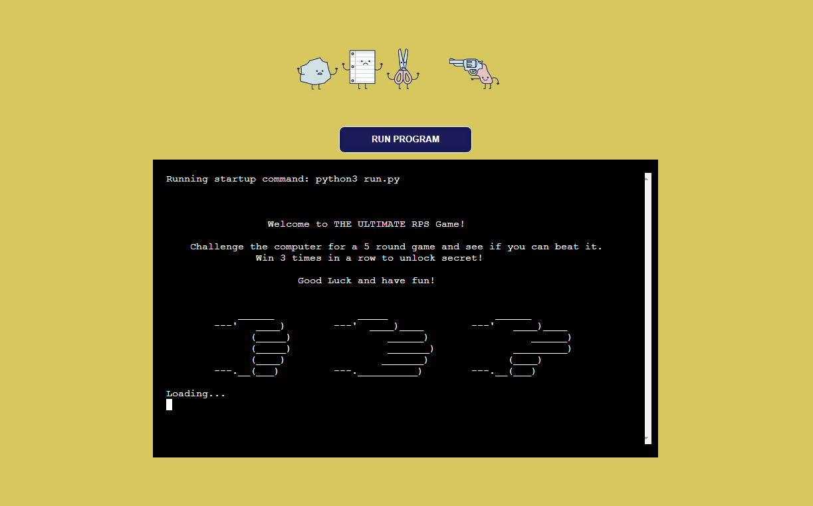
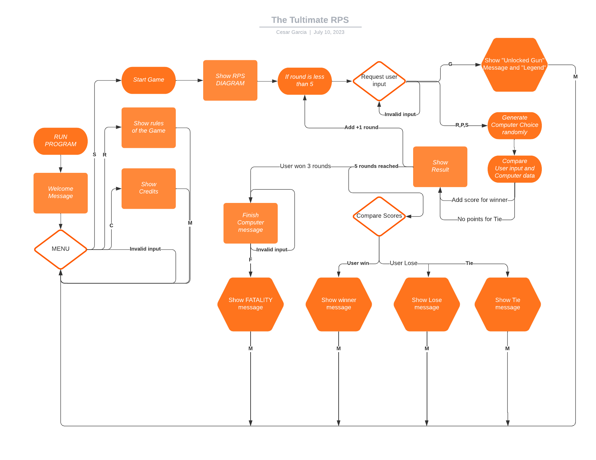

<h1 align="center"><a href="https://cesargarciajr.github.io/QuizTmas/" target="_blank">THE ULTIMATE RPS</a></h1> 

The Ultimate RPS is a fun and diferent approach for one of the most famous games of the world. Now as a backend application in a mock terminal you can have fun and chellange the computer for a 5 round game. If you in 3 times out of 5 a surprise is gonna be unlocked. Also pay attention to the hints and make a smart choice to become the RPS Legeng. Have fun!

[**Link to The Ultimate RPS**](https://the-ultimate-rps-75d98298966f.herokuapp.com/)

# Contents

- [The Ultimate RPS](#the-ultimate-rps)
- [Contents](#contents)
  - [User Experience (UX)](#user-experience-ux)
    - [User Stories](#user-stories)
    - [FlowChart](#flowchart)
    - [Site Structure](#site-structure)
    - [Desing Choices](#design-choices)
  - [Features](#features)
    - [Play Page](#play-page)
    - [Modal PopUp](#modal-popup)
    - [Answer Buttons](#answer-buttons)
    - [TimesUp Alert](#timesup-alert)
    - [TimesUp Alert](#timesup-alert)
    - [Hidden Cards](#hidden-cards)
    - [Game Over Message](#game-over-message)
    - [Rules Page](#rules-page)
    - [Contact Page](#contact-page)
    - [Future Features](#future-features)
  - [Testing](#testing)
    - [Testing Process](#testing-process)
    - [Bugs and Issues](#bugs-and-issues)
  - [Technologies Used](#technologies-used)
  - [Deployment](#deployment)
  - [Credits](#credits)
    - [Content](#content)
    - [Media](#media)
  - [Acknowledgments](#acknowledgments)
- [THANK YOU!](#thank-you)

___

## User Experience (UX)

  ### User Stories

  - #### First-Time Visitor Goals
     i.   As a First time user I want to be able to intuitively learn how to play the game without even reading the Rules.
     ii.  But if needed check the Rules and see if its clear.
     iii. I might have to contact the developer for any bug or leave a message.
     iv.  Have fun!

  - #### Returning Visitor Goals
     i.   As returning user I want the be able to play the game.
     ii.  Check if there is any updates to the game.
     iii. Have fun!

  - #### Frequent User Goals
    i.   As frequent user I want the be able to play the game.
    ii.  Check if there is anyupdates to the game.
    iii. Have fun!

  [Back to top](<#contents>)
  
  - ### FlowChart
    The flowchart was a very useful tool to plan ahead and understand how to build the application below you can see the chart that was made using the [**Lucid**](https://lucid.co/)

    

[Back to top](<#contents>)

  - ### Design Choices
      The idea was to build a terminal based application with smooth transitions to make the UX even more seamless and intuitive. I added few diagrams to make the game more user friendly and make look better as you can see the images below:

    
    
    
    

[Back to top](<#contents>)

## Features

  ### Play Page
The Play Page is also the landing page, where the user can easily learn and understand the website. It consists with a TOP Link over the "QuizTmas" title, a navegation bar that directs to the differents pages and the Play Area. Where the user car see 25 different cards also a Tally area, where all the right answers, wrong answers and number of questions already answered. Can game is very intuitive smooth to play. All the style choices where made based on Christmas theme, to make it more fun, enjoyable and exciting.

   

[Back to top](<#contents>)

  ### Modal PopUp
Once you click in on of th cards a moldal popup pops and display a random question from a pool of 50 different fun facts questions about Christmas. The modal pop up design is user friendly and easy to understand how to play. A timer starts to countdown from 15 seconds for the user to pick one of the questions.

   
  
[Back to top](<#contents>)
        
  ### Answer Buttons
The answers buttons display 4 buttons. Three of them are wrong answers and only one is right. If the right answered is picked it will turn the button into a green color. If the wrong answers is picked, is will turn the button into a red color and display the right answer in green color as the countdown timer stops and a next button is displayed to close the modal popup and allow the user to go back to the play area and pick another card.

   

[Back to top](<#contents>)

  ### TimesUp Alert
If the user does not manage to pick a answer in time. a alert is displayed with a "TimesUp!" message. And a wrong answers will be incremented.

   
 
[Back to top](<#contents>)

  ### Hidden Cards
Every time the user picks a card. The card will desapear so the user knows the ones already picked and the ones left in a very interactive proposal.

   
 
[Back to top](<#contents>)

  ### Game Over Message
Once the user picked 10 cards a Game Over message will display and show the amount of correct answers wrong answers. Also a restart button the will reload the page and restart the game. 

   
 
[Back to top](<#contents>)

  ### Rules Page
It's a simple page where all the rules are explained to the user, easy, clear and simple to understand.

   
 
[Back to top](<#contents>)

  ### Contact Page
Contact page the user can reach the developer in any of the three links provided that will open in a different tab for better UX.

   
 
[Back to top](<#contents>)

  ### Future Features
We want to implement 2 different surprise cards. So everytime the user picks a card he can either pick a Santa Claus picture, a Grinch picture or a question.
If the user picks a Santa Claus it will give him a 2 points Bonus. If the user picks a Grinch card it will lose 3 points, and if the user picks a question he has a chance either to win one point by picking the right answer or lose a point. 

[Back to top](<#contents>)

## Testing

The game was tested in differents 

- Tested in differents mobile devices and web browsers
- Tested using the [**CCS validador**](https://www.w3.org/)
- Tested using the [**HTML validator**](https://validator.w3.org/nu/)
- Tested using the [**JsHint Validator**](https://jshint.com/)
- Tested using the Lighthouse dev tool from Google Chrome

You can see the reports below as mentioned before:

Css validator report

HTML checker report

Jshint report

Lighthouse dev tool from Google Chrome Report

### Testing Process

  | Test                | Action                   | Success Criteria  |
  | -------------       |-------------             | -----|
  | Landingpage loads      | Navigate to website URL  | Page loads < 5s, no errors |
  | Links            | Click on each Navigation link  | Correct section is redirected action performed |
  | Gameplay  | Click the cards, answers buttons and counting the right, wrong and number of questions | The game is working as it should with no errors and malfunction |
  | Responsiveness | Resize the viewport window from 320px upwards with Chrome Dev Tools. Use Responsive Design Checker to test various mobile, tablet, and large screen sizes | Page layout remains intact and adapts to screen size|
  | Different web browsers | Runned the game in Google Chrome, Mozilla Firefox and Internet Explorer | Game works responsive and layout remains intact no errors or bug detected |
  | Different screen devices | Runned the game using a Samsung Galaxy s20 and Iphone 13 | Game works responsive and layout remains intact no errors or bug detected |

[Back to top](<#contents>)

 ### Unsolved bugs

Debugging and troubleshooting were done constantly throughout development, however still a problem with the website:

When the user reaches the 10th question and tries to open the a new card the Game Over message appears on the modal popup but in the top right corner it counts as a "question" as displayed in the image below. One of the solutions would make the modal popup bigger when the message is displayed so it would cover the tally area. But I was not happy "hiding" the bug, I wanted to have a proper and better idea of solution, but unfurtunatly haven't managed the time to review the code and re-design a best solution yet.

 

[Back to top](<#contents>)

___

## Technologies Used
I used the following technologies, platforms and support in building my project:
- Wireframes and mockups were designed in [**Balsamiq**](https://balsamiq.com/wireframes/desktop/#)
- The website is built with HTML, CSS and JavaScript.
- The [**Code Institute**](https://codeinstitute.net/) modules/lessons aided my learning and many of the concepts learned were applied in this project.
- [**GitHub**](https://github.com/Cesargarciajr/bloom-of-life) was used for the project repository.
- [**Google Fonts**](https://fonts.google.com/) was used for all fonts on the site.
- [**FontAwesome**](https://fontawesome.com/) was used for the social media icons which then had additional styling applied to them.
- [**Colors CO**](https://coolors.co/) was used to create a colour pallete for this readme file.
- [**Adobe Colors**](https://color.adobe.com/pt/create/color-contrast-analyzer) and contrast was used to pick color and check if the contrast was good enough for users.

[Back to top](<#contents>)

## Deployment

First of all you need to have a [**GitHub**](https://github.com/Cesargarciajr/bloom-of-life) account, I choose [**GitHub**](https://github.com/Cesargarciajr/bloom-of-life) because it's free and easy to create a repository to host your code and share with others.

- To create a repository you just need to go to the main page at the top right you will see a "+" button just click here and then new repository

- Select the name of the project and a description make it public and then create a repository

- Once you created your repository go the settings section and then click on pages

- Select the Branch as main and then save it.

- Finally, your repository is deployed and it should show you a link so you can share it with others.

[Back to top](<#contents>)

## Credits

  ### Content  
  - [**Code Institute**](https://codeinstitute.net/)  - Python Module and Tutor Support.
  - [**GitHub**](https://github.com/) - for deployment and host.
  - [**Code Anywhere**](https://app.codeanywhere.com/) - for IDE and editor of the code.
  - [**Precious Ijege**](https://www.linkedin.com/in/precious-ijege-908a00168/) - Mentor helping with insights and coding fix.
  - [**W3 Schools**](https://www.w3schools.com/) - used for multiples researches and tutorials in HTML and CSS.
  
[Back to top](<#contents>)

  ### Media
- [**Lucid**](https://lucid.co/) - Flowchart used on readme file.

[Back to top](<#contents>)

## Acknowledgments

This project definetly challenge my skills, I've learned so much throughout the process and can say I have a feeling of acomplishment from what I knew when I started this project and from what I know now. It definitly helped better understand concepts in coding also expand my knowledge in JavaScript. It was fun and enjoyable to built this game, I wan to thanks my mentor [**Precious Ijege**](https://www.linkedin.com/in/precious-ijege-908a00168/) for the support, help and guidance during the project.

by [**Cesar Garcia**](https://github.com/Cesargarciajr)

# THANK YOU!

[Back to top](<#contents>)